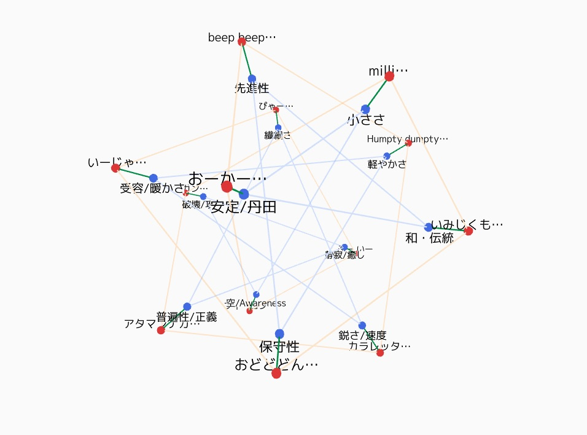

# Mind-Tensegrity

Interactive 3-layer tensegrity **language constellation** built with p5.js  
– tap = POP + sine tone ✧ drag = orbit ✧ pinch = zoom



## Try it

**Desktop / Mobile:** 
https://ryuta0201.github.io/Mind-Tensegrity/ 

> First tap will ask for audio permission on iOS.

## Controls
| Gesture | Effect |
|---------|--------|
| tap node | POP animation ＋ play note |
| one-finger drag | rotate scene |
| pinch | zoom | 

## Dev setup

```bash
npm i -g live-server          # once
live-server                   # hot-reload at http://localhost:5500

## 2 – Enable **GitHub Pages**

1. Open your repo in the browser  
   `https://github.com/ryuta0201/Mind-Tensegrity`
2. **Settings → Pages** (left sidebar)
3. **Branch**: choose **main** (or `dev` if that’s your stable branch)  
   **Folder**: `/` (root)   → **Save**
4. Wait ~30 s. A green banner appears with your new URL:  

